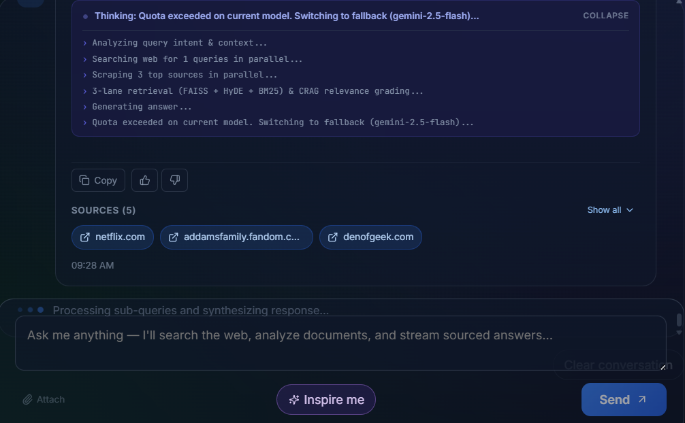
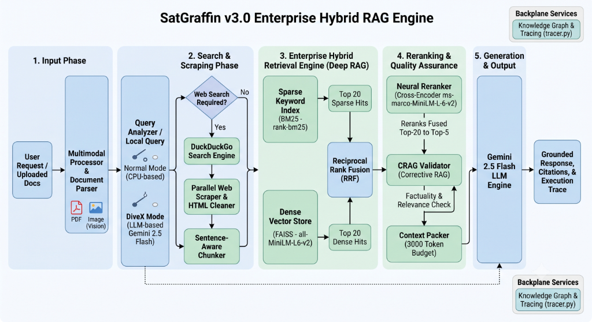

<div align="center">


# 🛰️ SatGraffin v3.0

### **Enterprise-Grade Hybrid RAG AI Research Assistant**

*Powered by Gemini 2.5 Flash, Dual Retrieval (BM25 + FAISS), RRF Fusion, Cross-Encoder Reranking & Live Web Synthesis.*

[](https://www.python.org/)
[](https://fastapi.tiangolo.com/)
[](https://react.dev/)
[](https://vitejs.dev/)
[](https://aistudio.google.com/)
[](LICENSE)
[](https://github.com/Sivaselvan-S/SatGraffin/pulls)

</div>

---

## 📌 Table of Contents

- [🌟 Overview](#-overview)
- [✨ Key Features](#-key-features)
- [🖼️ System Visuals & Interface](#️-system-visuals--interface)
- [🏗️ Architecture & Pipeline Flow](#️-architecture--pipeline-flow)
- [⚙️ Pipeline Modes (Normal vs. DiveX)](#️-pipeline-modes-normal-vs-divex)
- [⚡ Quick Start Guide](#-quick-start-guide)
  - [Backend Setup](#1-backend-setup)
  - [Frontend Setup](#2-frontend-setup)
- [🔑 Environment Variables & Configuration](#-environment-variables--configuration)
- [🔌 API Reference](#-api-reference)
- [📁 Project Directory Structure](#-project-directory-structure)
- [🛠️ Tech Stack](#️-tech-stack)
- [🐛 Troubleshooting & FAQs](#-troubleshooting--faqs)
- [🤝 Contributing & License](#-contributing--license)

---

## 🌟 Overview

**SatGraffin v3.0** is an open-source, production-ready AI research engine that turns raw user queries into deep, hallucination-free, heavily cited intelligence reports. 

Unlike conventional static RAG pipelines that rely on pre-indexed knowledge, SatGraffin operates **dynamically**:
1. It analyzes queries and performs real-time multi-query web searches.
2. It parallel-scrapes web pages, PDFs, and rich media on-the-fly.
3. It constructs an instant, in-memory Knowledge Base powered by **Hybrid Retrieval** (sparse BM25 + dense FAISS embeddings).
4. It merges, ranks, and re-evaluates content using **Reciprocal Rank Fusion (RRF)** and a **Cross-Encoder Neural Reranker**.
5. It synthesizes grounded answers using **Google Gemini 2.5 Flash** complete with transparent source citations and execution trace metrics.

---

## ✨ Key Features

- **🔍 Live Web Retrieval & Parallel Scraping**: Real-time DuckDuckGo web search with headless parallel web parsing and automated caching (configurable up to 6+ hours).
- **🔀 Hybrid Dual Retrieval Engine**:
  - **Sparse Keyword Search**: BM25 retriever for exact keyword matching (identifiers, technical terms).
  - **Dense Semantic Search**: FAISS vector database using `sentence-transformers/all-MiniLM-L6-v2`.
- **⚡ Advanced Ranking Architecture**:
  - **RRF (Reciprocal Rank Fusion)**: Combines dense & sparse candidate rankings without requiring normalized distance scores.
  - **Cross-Encoder Neural Reranking**: Re-evaluates top 20 documents using `cross-encoder/ms-marco-MiniLM-L-6-v2` for precise context selection.
- **🧠 Query Intelligence (HyDE & CRAG)**:
  - **HyDE (Hypothetical Document Embeddings)**: Generates hypothetical response vectors to elevate search retrieval depth.
  - **CRAG (Corrective RAG)**: Validates context relevance before sending prompts to the LLM.
- **⚡ Dual Execution Modes**:
  - **Normal Mode (Quota / API Saver)**: Offloads Query Analysis, HyDE, and CRAG validation to local CPU algorithms — guaranteeing only **1 Gemini API call per query**.
  - **DiveX Mode (Deep RAG)**: Full LLM multi-step reasoning for maximum accuracy.
- **🖼️ Multimodal Processing**: Ingests uploaded documents, text files, and images for vision-assisted context analysis.
- **🎨 Modern Interactive UI**: Built with React 19, TypeScript, Vite, Framer Motion animations, real-time thinking step breakdown, dynamic context selector, and source link previews.

---

## 🖼️ System Visuals & Interface

<div align="center">
  
  <p><em>Figure 1: SatGraffin UI featuring Real-Time Thinking Steps, Grounded Answers, and Source Cards.</em></p>
</div>

---

## 🏗️ Architecture & Pipeline Flow

<div align="center">
  
  <p><em>Figure 2: SatGraffin v3.0 Enterprise Hybrid RAG Engine Architecture Diagram.</em></p>
</div>

### Stage Breakdown

| Stage | Component | Technical Function |
| :--- | :--- | :--- |
| **1. Analysis** | `QueryAnalyzer` / `LocalQueryAnalyzer` | Rewrites user intent into search engine friendly queries. |
| **2. Retrieval** | `DuckDuckGo` + `ParallelScraper` | Fetches live web pages, strips scripts/navs/footers, and caches text. |
| **3. Indexing** | `SentenceAwareChunker` | Splits text into 500-token semantic chunks while preserving sentence boundaries. |
| **4. Dual RAG** | `FAISS` + `BM25Retriever` | Computes dense vector similarity and sparse BM25 term frequency scores. |
| **5. Fusion** | `RRF (Reciprocal Rank Fusion)` | Combines rank orders of dense and sparse retrievers without score distortion. |
| **6. Reranking**| `CrossEncoderReranker` | Uses joint sentence transformer to score query-document semantic pair alignment. |
| **7. Generation**| `Gemini 2.5 Flash` | Constructs low-temperature (0.2) grounded responses with accurate citations. |

---

## ⚙️ Pipeline Modes (Normal vs. DiveX)

SatGraffin provides **configurable pipeline modes** to balance speed, API cost, and deep reasoning:

| Feature / Mode | ⚡ Normal Mode (API Saver - Default) | 🧠 DiveX Mode (Deep RAG) |
| :--- | :--- | :--- |
| **Query Rewriting** | Fast local CPU regex/heuristic rules | Gemini LLM Query Decomposition |
| **HyDE Expansion** | Local keyword phrase expansion | Gemini LLM Hypothetical Document Generation |
| **CRAG Validation** | Local lexical overlap metric | Gemini LLM Context Relevance Evaluator |
| **Gemini API Calls** | **Strictly 1 call per query** | 3-5 calls per query |
| **Ideal For** | High volume, fast response, low cost/quota | Complex academic research & multi-hop queries |

> *Toggle `API_SAVER_MODE=false` in `backend/.env` to enable full DiveX mode.*

---

## ⚡ Quick Start Guide

### Prerequisites
- **Python**: `3.11` or higher (tested on 3.11 & 3.12)
- **Node.js**: `18.0` or higher & `npm`
- **Google Gemini API Key**: Free key from [Google AI Studio](https://aistudio.google.com/app/apikey)

---

### 1. Backend Setup

```bash
# Navigate into backend
cd backend

# 1. Create virtual environment
python -m venv .venv

# 2. Activate virtual environment
# On Windows:
.venv\Scripts\activate
# On Linux/macOS:
source .venv/bin/activate

# 3. Install backend dependencies
pip install -r requirements.txt

# 4. Create environment configuration
copy .env.example .env     # On Windows
# cp .env.example .env     # On Linux/macOS

# Edit backend/.env and add your GOOGLE_API_KEY:
# GOOGLE_API_KEY="AIzaSy..."

# 5. Launch FastAPI development server
uvicorn main:app --reload --port 8000
```

> ℹ️ **First Launch Note:** On initial run, the backend automatically downloads local transformer weights:
> - Embedding Model: `sentence-transformers/all-MiniLM-L6-v2` (~90 MB)
> - Reranker Model: `cross-encoder/ms-marco-MiniLM-L-6-v2` (~80 MB)
> - NLTK Tokenizer tables (`punkt_tab`)
> 
> *Subsequent starts load instantly from local cache.*

---

### 2. Frontend Setup

```bash
# Open a new terminal and navigate to frontend
cd frontend

# 1. Install frontend dependencies
npm install

# 2. Configure environment (Optional if backend runs on http://localhost:8000)
copy .env.example .env.local    # On Windows
# cp .env.example .env.local    # On Linux/macOS

# 3. Launch Vite development server
npm run dev
```

Open your browser at **`http://localhost:5173`**.

---

## 🔑 Environment Variables & Configuration

### Backend (`backend/.env`)

| Environment Variable | Required | Default Value | Description |
| :--- | :---: | :---: | :--- |
| `GOOGLE_API_KEY` | ✅ **Yes** | — | Google Gemini API secret key. |
| `GEMINI_MODEL_NAME` | ❌ No | `gemini-2.5-flash` | Gemini model version to target. |
| `API_SAVER_MODE` | ❌ No | `true` | `true` for 1-call Local CPU mode; `false` for DiveX Deep RAG. |
| `CACHE_DURATION_HOURS` | ❌ No | `6` | Expiration time for cached web scraper pages. |
| `MAX_SEARCH_RESULTS` | ❌ No | `5` | Maximum DuckDuckGo search hits per query. |
| `MAX_SCRAPE_PAGES` | ❌ No | `3` | Maximum concurrent web pages to scrape & index. |

### Frontend (`frontend/.env.local`)

| Environment Variable | Required | Default Value | Description |
| :--- | :---: | :---: | :--- |
| `VITE_API_BASE_URL` | ❌ No | `http://localhost:8000` | Target FastAPI backend URL endpoint. |

---

## 🔌 API Reference

### 1. `POST /api/query` — Main Research Query Endpoint
Sends a research prompt to the RAG pipeline.

**Request Body:**
```json
{
  "query": "What are the latest breakthroughs in solar panel efficiency in 2026?",
  "user_id": "user_123",
  "force_refresh": false
}
```

**Response Output:**
```json
{
  "response": "Recent breakthroughs in solar technology focus on perovskite-silicon tandem cells...",
  "answer": "Recent breakthroughs in solar technology...",
  "source_links": [
    "https://example.com/solar-research-2026",
    "https://energy-news.org/tandem-cells"
  ],
  "source_documents": [
    {
      "page_content": "Perovskite-silicon tandem solar cells achieved a record 34.6% efficiency...",
      "metadata": { "source": "https://example.com/solar-research-2026" }
    }
  ],
  "search_query": "latest breakthroughs solar panel efficiency 2026"
}
```

### 2. Additional Endpoints

| Endpoint Method | Route | Description |
| :--- | :--- | :--- |
| `GET` | `/` | API status and server banner. |
| `GET` | `/api/health` | Detailed health check, vector store size, and pipeline mode. |
| `POST` | `/api/upload` | Upload PDF or document files for local RAG ingestion. |
| `POST` | `/api/clear-cache` | Flushes all cached web page text and resets temporary indexes. |

---

## 📁 Project Directory Structure

```
SatGraffin/
├── 📁 docs/
│   └── 📁 images/                  # Repository Screenshots & Architecture Visuals
│       ├── architecture-flow.png   # Enterprise Hybrid RAG Engine Diagram
│       ├── satgraffin-logo.svg     # Official SatGraffin Logo Vector
│       └── ui-demo.png             # Application Interface Screenshot
├── 📁 backend/
│   ├── 📁 hybrid_rag/              # Modular Hybrid RAG Core Framework
│   │   ├── bm25_retriever.py       # Sparse BM25 keyword search engine
│   │   ├── chunker.py              # Sentence-aware text chunking
│   │   ├── context_packer.py       # Context token budgeting & packing
│   │   ├── crag_validator.py       # Corrective RAG context verification
│   │   ├── cross_encoder_reranker.py # Neural cross-encoder reranking
│   │   ├── feedback_loop.py        # System feedback & retrieval scoring
│   │   ├── hyde.py                 # Hypothetical document expansion
│   │   ├── knowledge_graph.py      # Entity & Knowledge Graph relationships
│   │   ├── local_query_analyzer.py # Local CPU fast query parser
│   │   ├── multimodal_processor.py # Vision, image & PDF document parsing
│   │   ├── prompt_builder.py       # Dynamic grounded prompt generator
│   │   ├── query_analyzer.py       # LLM query decomposer
│   │   ├── rrf_fusion.py           # Reciprocal Rank Fusion algorithm
│   │   └── tracer.py               # Pipeline trace logging & metrics
│   ├── 📄 main.py                  # FastAPI server & route handlers
│   ├── 📄 requirements.txt         # Python dependencies
│   ├── 📄 ARCHITECTURE.md          # Technical architecture design doc
│   └── 📄 .env.example             # Backend environment template
│
└── 📁 frontend/
    ├── 📁 src/
    │   ├── 📁 components/          # React UI Components
    │   │   ├── ChatInput.tsx       # Prompt submission component
    │   │   ├── ContextSelector.tsx # Source context filter pills
    │   │   ├── FileUpload.tsx      # Drag-and-drop document uploader
    │   │   ├── Header.tsx          # Navigation header with mode status
    │   │   ├── MessageBubble.tsx   # Markdown message renderer with citations
    │   │   ├── ModeSelector.tsx    # Pipeline mode toggle switch
    │   │   ├── ModelSelector.tsx   # Gemini model selector dropdown
    │   │   ├── SourceLinks.tsx     # Citation cards with web source links
    │   │   └── ThinkingSteps.tsx   # Real-time pipeline step visualizer
    │   ├── 📄 App.tsx              # Main Application layout
    │   └── 📄 types.ts             # TypeScript definitions
    ├── 📄 package.json             # Frontend npm dependencies
    └── 📄 .env.example             # Frontend environment template
```

---

## 🛠️ Tech Stack

| Layer | Framework / Technology | Purpose |
| :--- | :--- | :--- |
| **Language & Runtime** | Python 3.11+, TypeScript, Node.js 18+ | Backend logic, type safety, async execution |
| **Web Server** | FastAPI, Uvicorn, Asyncio | Async API routing & background scraping tasks |
| **LLM Engine** | Google Gemini 2.5 Flash (`langchain-google-genai`) | Low-latency grounded answer generation |
| **Vector Store** | FAISS (`faiss-cpu`) | Fast dense vector indexing and similarity search |
| **Embeddings** | Hugging Face (`sentence-transformers/all-MiniLM-L6-v2`) | 384-dimensional dense semantic embeddings |
| **Lexical Search** | `rank-bm25` | Sparse keyword frequency matching |
| **Reranker** | Cross-Encoder (`cross-encoder/ms-marco-MiniLM-L-6-v2`) | High-precision candidate reranking |
| **Web Scraping** | BeautifulSoup4, Requests, DuckDuckGo Search | Real-time web retrieval & DOM text cleaning |
| **Frontend Framework** | React 19, Vite, Framer Motion, Lucide React | High-performance UI rendering & visualizer |

---

## 🐛 Troubleshooting & FAQs

<details>
<summary><b>1. Why does the backend pause on the first query?</b></summary>
<br>
On first startup, the backend downloads the HuggingFace embedding model (~90MB) and Cross-Encoder model (~80MB) directly to your local drive (<code>~/.cache/huggingface/</code>). Subsequent queries run in milliseconds without downloading.
</details>

<details>
<summary><b>2. How do I enable PyTorch GPU acceleration?</b></summary>
<br>
By default, <code>requirements.txt</code> installs CPU PyTorch. If you have an NVIDIA GPU with CUDA:
<pre><code>pip uninstall torch
pip install torch --index-url https://download.pytorch.org/whl/cu121</code></pre>
</details>

<details>
<summary><b>3. How do I switch between API Saver Mode and Deep RAG?</b></summary>
<br>
Set <code>API_SAVER_MODE=true</code> in <code>backend/.env</code> for 1-call local mode, or <code>API_SAVER_MODE=false</code> to enable full multi-step LLM HyDE and CRAG reasoning.
</details>

---

## 🤝 Contributing & License

Contributions, issues, and feature requests are very welcome! Feel free to check the [issues page](https://github.com/Sivaselvan-S/SatGraffin/issues).

1. Fork the Project
2. Create your Feature Branch (`git checkout -b feature/AmazingFeature`)
3. Commit your Changes (`git commit -m 'Add some AmazingFeature'`)
4. Push to the Branch (`git checkout -b feature/AmazingFeature`)
5. Open a Pull Request

Distributed under the **MIT License**. See `LICENSE` for more information.

<div align="center">
  <sub>Built with ❤️ by Sivaselvan S & the SatGraffin Open Source Community</sub>
</div>