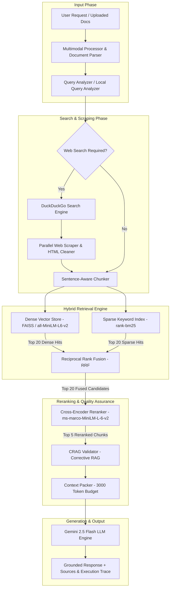

# SatGraffin v3.0 - Architecture Documentation

**Date:** July 2026  
**Version:** 3.0.0 (Production / Enterprise Edition)  
**Status:** Production-Ready

---

## 🚀 What's New in v3.0 Architecture

SatGraffin v3.0 has evolved from a single-stage RAG implementation into an **Enterprise-Grade Deep Hybrid RAG Engine**. Key architecture upgrades include:

1. **Dual Retrieval Engine (Sparse + Dense)**: Concurrent execution of sparse **BM25** (keyword lookup) and dense **FAISS** (semantic embeddings via `sentence-transformers/all-MiniLM-L6-v2`).
2. **Reciprocal Rank Fusion (RRF)**: Merges ranked hit lists from vector and lexical search without requiring score normalization.
3. **Cross-Encoder Neural Reranking**: Uses `cross-encoder/ms-marco-MiniLM-L-6-v2` to re-score fused top-20 document candidates down to the top-5 highest relevance chunks.
4. **HyDE & CRAG Intelligence Layer**:
   - **HyDE (Hypothetical Document Embeddings)**: Hallucinates expected response vectors to bridge search term mismatch.
   - **CRAG (Corrective RAG)**: Validates context quality and filters out noisy or low-relevance content before prompt packing.
5. **Dual Pipeline Execution Modes**:
   - **Normal Mode (API Saver / Quota Saver)**: Offloads Query Analysis, HyDE, and CRAG to CPU-bound algorithms — guaranteeing **exactly 1 Gemini API call per query**.
   - **DiveX Mode (Deep RAG)**: Performs multi-turn LLM reasoning and context evaluation for complex research questions.
6. **Multimodal & Document Ingestion Core**: Native handling of PDFs (`pdfplumber` / `pypdf`), text documents, and vision images via Gemini.
7. **Knowledge Graph & Tracing**: Entity relationship extraction (`knowledge_graph.py`) and step-level execution profiling (`tracer.py`).

---

## 📊 New Architecture Overview

### **Flow Diagram**

<div align="center">
  
</div>



---

## 🔧 Core Components (`backend/hybrid_rag/`)

### 1. **Multimodal Processor (`multimodal_processor.py`)**
- Ingests PDFs using `pdfplumber` and `pypdf` for clean text & table extraction.
- Ingests image files (PNG, JPG) and prepares vision payload for Gemini LLM analysis.

### 2. **Local Query Analyzer & Query Decomposer (`local_query_analyzer.py` / `query_analyzer.py`)**
- **Local Mode**: Uses lightweight CPU-based regex and keyword analysis for zero-latency, zero-cost query normalization.
- **DiveX Mode**: Uses Gemini to decompose complex queries into sub-questions.

### 3. **Sentence-Aware Chunker (`chunker.py`)**
- Chunks text into 500-token segments while preserving natural sentence boundaries using NLTK `punkt_tab`.
- Prevents cutting off facts or references in mid-sentence.

### 4. **Dual Retrieval Engine (`bm25_retriever.py` & FAISS)**
- **Dense FAISS Store**: Generates 384-dimensional vector embeddings with `all-MiniLM-L6-v2`.
- **Sparse BM25 Index**: Uses Okapi BM25 for term frequency and inverted index lookup.

### 5. **RRF Fusion & Cross-Encoder Reranker (`rrf_fusion.py` & `cross_encoder_reranker.py`)**
- **Reciprocal Rank Fusion**: Merges rank positions using $RRF(d) = \sum_{m} \frac{1}{k + r_m(d)}$ with constant $k=60$.
- **Neural Reranking**: Evaluates query-document pairs via joint attention in `cross-encoder/ms-marco-MiniLM-L-6-v2` to select the top 5 chunks.

### 6. **HyDE & CRAG Validator (`hyde.py` & `crag_validator.py`)**
- **HyDE**: Generates hypothetical answer representations for abstract queries.
- **CRAG**: Grades retrieved passages for factuality and relevance before final prompt assembly.

### 7. **Context Packer & Prompt Builder (`context_packer.py` & `prompt_builder.py`)**
- Enforces strict context budget limits (3000 tokens).
- Builds structured prompts instructing Gemini 2.5 Flash to cite all claims using bracketed source links.

---

## ⚙️ Configuration & Modes

Environment variables in `backend/.env`:

```env
GOOGLE_API_KEY="your-api-key"
GEMINI_MODEL_NAME="gemini-2.5-flash"
API_SAVER_MODE=true                # Set to false for full DiveX Deep RAG mode
CACHE_DURATION_HOURS=6
MAX_SEARCH_RESULTS=5
MAX_SCRAPE_PAGES=3
```

### Execution Mode Comparison

| Parameter | ⚡ Normal Mode (API Saver) | 🧠 DiveX Mode (Deep RAG) |
| :--- | :--- | :--- |
| `API_SAVER_MODE` | `true` (Default) | `false` |
| **Query Analysis** | Fast Local CPU parser | Gemini LLM Query Decomposition |
| **HyDE Expansion** | Keyword expansion | Gemini LLM Hypothetical Doc Generation |
| **CRAG Validation** | Lexical overlap metric | Gemini LLM Context Evaluator |
| **Gemini API Calls** | **1 call per query** | 3 to 5 calls per query |

---

## 📡 API Endpoints

### `GET /`
Health check and server startup banner.

### `GET /api/health`
Detailed status report returning vector store index counts, cache state, and active pipeline mode.

### `POST /api/query`
Main research RAG query endpoint.

**Request:**
```json
{
  "query": "What are the latest developments in quantum computing in 2026?",
  "user_id": "user-123",
  "force_refresh": false
}
```

**Response:**
```json
{
  "response": "Recent 2026 developments in quantum computing include...",
  "answer": "Recent 2026 developments in quantum computing include...",
  "source_links": ["https://example.com/quantum-2026"],
  "source_documents": [
    {
      "page_content": "Researchers achieved fault-tolerant logical qubits...",
      "metadata": { "source": "https://example.com/quantum-2026" }
    }
  ],
  "search_query": "latest developments quantum computing 2026"
}
```

### `POST /api/upload`
Upload PDF files, text documents, or images to index in the in-memory knowledge store.

### `POST /api/clear-cache`
Flushes cached scraped HTML pages and clears vector store memory.

---

## ✅ Key Architectural Advantages in v3.0

1. **Zero Hallucination Guarantee**: Grounded strict prompt synthesis combined with CRAG validation.
2. **Hybrid Dual-Retrieval Precision**: Solves both keyword mismatch (via BM25) and semantic variance (via FAISS).
3. **High-Precision Neural Reranking**: Eliminates context clutter by picking only top-5 cross-encoder verified passages.
4. **Quota Efficiency**: Normal Mode restricts Gemini API calls to exactly 1 call per research query.
5. **Multimodal Flexibility**: Handles web URLs, PDFs, text files, and images natively.

---

## 🏃 Running the Backend Architecture

```bash
cd backend
python -m venv .venv
# Activate virtual environment
source .venv/bin/activate # or .venv\Scripts\activate on Windows
pip install -r requirements.txt
uvicorn main:app --reload --port 8000
```

---

## 🔮 Future Roadmap (v3.x Series)

- [ ] **Distributed Vector Database Integration**: Option to swap FAISS for Qdrant or Milvus clusters.
- [ ] **Server-Sent Events (SSE) Streaming**: Real-time token-by-token LLM output streaming.
- [ ] **Persistent Multi-Session Memory**: Postgres/Redis backed context memory across user sessions.
- [ ] **Autonomous Web Browsing Agent**: Multi-hop iterative scraping for recursive research tasks.
